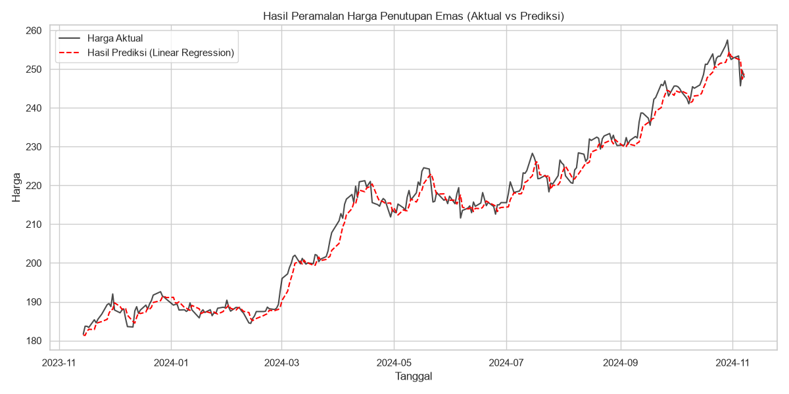
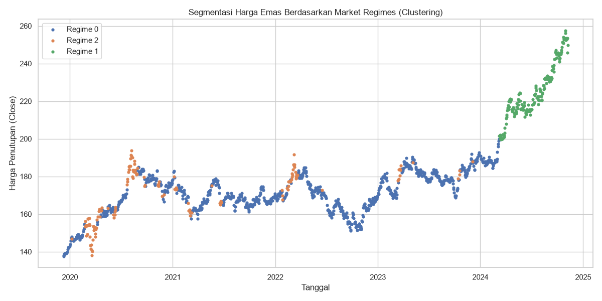

# Analisis dan Peramalan Harga Emas Menggunakan Metode Binary Ant Colony Optimization dan Machine Learning

Dokumentasi ini menjelaskan mengenai implementasi proyek peramalan harga penutupan harian emas (Gold Price Forecasting) dengan mengintegrasikan algoritma metaheuristik Binary Ant Colony Optimization (ACO) untuk seleksi fitur, algoritma K-Means Clustering untuk segmentasi regime pasar, serta Linear Regression untuk pemodelan prediktif.

---

## Deskripsi Dataset

Dataset utama yang digunakan dalam proyek ini adalah data harga historis transaksi emas harian yang disimpan dalam berkas [Gold  Prices.csv]. Rincian struktur kolom dan tipe data pada berkas tersebut adalah sebagai berikut:

| Nama Kolom | Deskripsi | Tipe Data |
| :--- | :--- | :--- |
| **Date** | Tanggal pencatatan transaksi perdagangan emas | Runtun Waktu (DateTime) |
| **Open** | Harga pembukaan perdagangan emas pada hari tersebut | Numerik (Float) |
| **High** | Harga tertinggi yang dicapai emas pada hari tersebut | Numerik (Float) |
| **Low** | Harga terendah yang dialami emas pada hari tersebut | Numerik (Float) |
| **Close** | Harga penutupan perdagangan emas pada hari tersebut | Numerik (Float) |
| **Volume** | Jumlah unit/kontrak emas yang ditransaksikan | Numerik (Integer) |
| **Dividends** | Nilai dividen yang dibagikan pada hari tersebut (bernilai konstan 0.0) | Numerik (Float) |
| **Stock Splits** | Nilai pemecahan saham pada hari tersebut (bernilai konstan 0.0) | Numerik (Float) |
| **Capital Gains** | Keuntungan modal yang didistribusikan pada hari tersebut (bernilai konstan 0.0) | Numerik (Float) |

*Catatan: Kolom Dividends, Stock Splits, dan Capital Gains memiliki nilai konstan nol (0.0) karena aset emas komoditas fisik murni tidak mendistribusikan pembagian keuntungan berkala seperti halnya aset ekuitas/saham.*

---

## Metodologi Proyek

1. **Rekayasa Fitur (Feature Engineering)**
   Berdasarkan dataset harga historis emas [Gold  Prices.csv], dihitung beberapa indikator teknikal sebagai fitur masukan model:
   - *Daily Return* (imbal hasil harian).
   - *Simple Moving Average* (SMA) periode 5-hari dan 20-hari (MA5 dan MA20).
   - *Volume Moving Average* periode 5-hari (Vol_MA5).
   - Volatilitas harga (simpangan baku pergerakan return harian dalam rentang 5-hari).
   - Variabel target yang diprediksi adalah harga penutupan satu hari ke depan (`Target_Close`).

2. **Seleksi Fitur Menggunakan Binary Ant Colony Optimization (ACO)**
   - Algoritma ACO berbasis biner digunakan untuk mengoptimasi dan memilih fitur-fitur teknikal yang paling relevan.
   - Penilaian kelayakan kombinasi fitur diukur menggunakan nilai rata-rata Cross-Validation dari model klasifikasi `RandomForestClassifier`.

3. **Segmentasi Kondisi Pasar (Market Regime)**
   - Algoritma K-Means Clustering digunakan untuk mengelompokkan kondisi pasar emas harian ke dalam 3 jenis regime pasar yang berbeda.
   - Hasil klasterisasi kemudian divalidasi menggunakan `RandomForestClassifier` untuk memastikan reliabilitas pembagian kondisi pasar.

4. **Peramalan Harga Emas (Forecasting)**
   - Tahap akhir peramalan dilakukan dengan menggunakan algoritma `LinearRegression`.
   - Model dilatih dengan mengombinasikan fitur-fitur teknikal yang terpilih melalui ACO dan informasi regime pasar hasil clustering K-Means.

---

## Evaluasi dan Hasil Prediksi

Pengujian model dilakukan secara sekuensial dengan pembagian data runtun waktu sebesar 80% untuk data latih (training) dan 20% untuk data uji (testing). Metrik performa yang diperoleh adalah sebagai berikut:

* **R-Squared (R² Score)**: `0.9858` (Model mampu menjelaskan 98.58% variansi dari data harga emas aktual).
* **Mean Absolute Percentage Error (MAPE)**: `0.89%` (Kesalahan prediksi rata-rata model di bawah 1%).

### Grafik Perbandingan Harga Aktual vs Hasil Prediksi
Gambar di bawah ini menyajikan grafik perbandingan harga emas aktual terhadap harga prediksi yang dihasilkan oleh model Linear Regression:



*Visualisasi 3 tipe segmentasi pasar (market regimes) yang dihasilkan:*


---

## Panduan Penggunaan dan Cara Menjalankan

### 1. Dependensi Library Python
Pastikan library Python berikut telah terinstal pada sistem Anda:
```bash
pip install numpy pandas matplotlib seaborn scikit-learn
```

### 2. Berkas Proyek
- [`index.ipynb`]: Jupyter Notebook utama yang memuat seluruh alur pemrosesan data, pemodelan ACO, klasterisasi, dan forecasting.
- [`Gold  Prices.csv`]: Dataset harga emas historis.
- `gold_forecasting_lr.png`: Grafik visualisasi perbandingan harga aktual vs prediksi.
- `gold_regimes.png`: Grafik visualisasi 3 cluster kondisi pasar emas.

### 3. Eksekusi
Jalankan Jupyter Notebook [`index.ipynb`] secara berurutan untuk memproses data, melatih model optimasi seleksi fitur, melakukan klasterisasi pasar, dan menampilkan visualisasi hasil prediksi.
